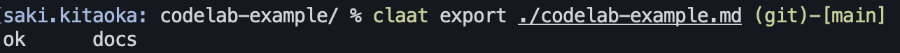

Author: ktksq
Summary: CodeLab-Example
Id: docs
Environments: Web
Status: Published
Feedback Link: https://github.com/ktksq/codelab-example

# CodeLab-Example

## sample-page1
Duration: 00:01:00

### **🔰 Chapter-1.1**
- sample-1.1

### **🔰 Chapter-1.2**
- sample-1.2

## sample-page2
Duration: 00:02:00
### **🔰 Chapter-2.1**
- sample-2.1

<aside class="positive">
This will appear in a positive info box.
</aside>

<aside class="negative">
This will appear in a negative info box.
</aside>

### **🔰 Chapter-2.2**
- sample-2.2

[過去の記事](https://ktksq.hatenablog.com/entry/deltalake)

